# ASL (American Sign Language) Recognition System - Architecture

A complete breakdown of how the entire ASL recognition program works, from data preparation to real-time inference.

---

## System Overview

---

## Detailed Component Breakdown

### 1. Data Preparation Pipeline

---

### 2. Model Architecture

```mermaid
flowchart TB
    subgraph MobileNetV2["CustomMobileNetV2 (Primary Model)"]
        direction TB
        BASE["MobileNetV2 Base<br/>(Pretrained ImageNet)"]

        subgraph Features["Feature Extraction"]
            F0["features[0]<br/>32 channels"]
            F1["features[1-N]"]
            ATT48["ChannelAttention(48)"]
            ATT96["ChannelAttention(96)"]
            ATT128["ChannelAttention(128)"]
            ATT256["ChannelAttention(256)"]
            ATT512["ChannelAttention(512)"]
        end

        subgraph Classifier["Custom Classifier"]
            DROP1["Dropout(0.2)"]
            FC1["Linear(last_channel → 512)"]
            RELU["ReLU"]
            DROP2["Dropout(0.5)"]
            FC2["Linear(512 → 26 classes)"]
        end

        GAP["Global Average Pooling<br/>x.mean([2, 3])"]

        BASE --> F0 --> F1
        F1 --> ATT48 --> ATT96 --> ATT128 --> ATT256 --> ATT512
        ATT512 --> GAP --> DROP1 --> FC1 --> RELU --> DROP2 --> FC2
    end

    subgraph Attention["Channel Attention Module"]
        direction LR
        AVG["AdaptiveAvgPool2d(1)"]
        FC_A["Conv2d(in → in/8)"]
        RELU_A["ReLU"]
        FC_B["Conv2d(in/8 → in)"]
        SIG["Sigmoid"]
        MUL["x × attention"]

        AVG --> FC_A --> RELU_A --> FC_B --> SIG --> MUL
    end

    INPUT["Input Image<br/>(3, 224, 224)"] --> MobileNetV2
    MobileNetV2 --> OUTPUT["Output<br/>26 class probabilities<br/>(A-Z)"]
```

---

### 3. Training Flow

---

### 4. Real-Time Inference Application

---

### 5. Frame Processing Pipeline

---

### 6. Label Mapping System

| Index | Label | Index | Label | Index | Label |
| ----- | ----- | ----- | ----- | ----- | ----- |
| 0     | A     | 10    | K     | 20    | U     |
| 1     | B     | 11    | L     | 21    | V     |
| 2     | C     | 12    | M     | 22    | W     |
| 3     | D     | 13    | N     | 23    | X     |
| 4     | E     | 14    | O     | 24    | Y     |
| 5     | F     | 15    | P     | 25    | Z     |
| 6     | G     | 16    | Q     |       |       |
| 7     | H     | 17    | R     |       |       |
| 8     | I     | 18    | S     |       |       |
| 9     | J     | 19    | T     |       |       |

---

### 7. File Structure Overview

---

## Complete End-to-End Flow

---

## Key Parameters

| Component        | Parameter                | Value   | Description               |
| ---------------- | ------------------------ | ------- | ------------------------- |
| **MediaPipe**    | min_detection_confidence | 0.7     | Hand detection threshold  |
| **MediaPipe**    | min_tracking_confidence  | 0.7     | Hand tracking threshold   |
| **Model**        | Input Size               | 224×224 | Image dimensions          |
| **Model**        | Num Classes              | 26      | A-Z letters               |
| **Training**     | Batch Size               | 100     | Samples per batch         |
| **Training**     | Learning Rate            | 0.001   | Adam optimizer            |
| **Training**     | Epochs                   | 10      | Training iterations       |
| **Inference**    | Confidence Threshold     | 0.7     | Min prediction confidence |
| **Inference**    | Prediction Window        | 10      | Frames to average         |
| **Inference**    | Prediction Delay         | 2s      | Cooldown between outputs  |
| **Augmentation** | Base Aug                 | 500     | Extra samples per class   |

---

## Technologies Used

- **PyTorch** - Deep learning framework
- **MediaPipe** - Hand landmark detection
- **OpenCV** - Video capture and image processing
- **Tkinter** - Desktop GUI framework
- **TorchVision** - MobileNetV2/ResNet18 pretrained models
- **NumPy** - Array operations and .npz compression
- **scikit-learn** - Train/test split and metrics
- **Matplotlib/Seaborn** - Visualization and evaluation plots
