# Real-Time ASL Inference Application - Deep Dive

A comprehensive, detailed breakdown of the real-time American Sign Language recognition application.

---

## Table of Contents

1. [Application Overview](#application-overview)
2. [Entry Point & Initialization](#entry-point--initialization)
3. [GUI Architecture](#gui-architecture)
4. [Video Capture Loop](#video-capture-loop)
5. [MediaPipe Hand Detection](#mediapipe-hand-detection)
6. [Hand Visualization System](#hand-visualization-system)
7. [Prediction Pipeline](#prediction-pipeline)
8. [Prediction Smoothing System](#prediction-smoothing-system)
9. [Sentence Building](#sentence-building)
10. [Complete Data Flow](#complete-data-flow)

---

## Application Overview

The real-time inference application is a desktop GUI that captures webcam video, detects hands using MediaPipe, extracts hand landmarks, and uses a trained MobileNetV2 model to classify ASL letters (A-Z) in real-time.


---

## Entry Point & Initialization

### Application Startup

```python
# frame.py - Lines 183-186
if __name__ == "__main__":
    root = tk.Tk()
    app = HandDetectionApp(root, "Hand Detection with Mediapipe")
```

### Initialization Sequence


### Initialization Constants

| Constant               | Value     | Purpose                                         |
| ---------------------- | --------- | ----------------------------------------------- |
| `PREDICTION_WINDOW`    | 10        | Number of frames to average predictions over    |
| `PREDICTION_DELAY`     | 2 seconds | Minimum time between adding letters to sentence |
| `CONFIDENCE_THRESHOLD` | 0.7       | Minimum confidence to accept a prediction       |
| `Window Size`          | 900×650   | Tkinter window dimensions                       |
| `Canvas Size`          | 640×480   | Video display dimensions                        |

### Device Detection


---

## GUI Architecture

### Component Layout


### Button Functions

```mermaid
flowchart LR
    subgraph Controls
        START["▶ Start"] -->|"start_video()"| RUN["running = True<br/>update_frame()"]
        STOP["⏹ Stop"] -->|"stop_video()"| HALT["running = False"]
        EXIT["✕ Exit"] -->|"window.quit()"| CLOSE["Close application"]
    end

    subgraph TextEditing
        DELETE["Delete"] -->|"delete_last_sign()"| DEL["sentence = sentence[:-1]"]
        SPACE["Space"] -->|"add_space()"| SPC["sentence += ' '"]
        RESET["Reset"] -->|"reset_sentence()"| CLR["sentence = ''"]
    end
```



### Color Scheme

| Component      | Background | Foreground | Hex Code              |
| -------------- | ---------- | ---------- | --------------------- |
| Window         | Dark       | -          | `#333333`             |
| Canvas         | Darker     | -          | `#222222`             |
| Title          | Dark       | White      | `#333333` / `#FFFFFF` |
| Start Button   | Green      | White      | `#4CAF50`             |
| Stop Button    | Red        | White      | `#f44336`             |
| Exit Button    | Gray       | White      | `#555555`             |
| Delete Button  | Pink       | White      | `#FF4081`             |
| Space Button   | Cyan       | White      | `#00BCD4`             |
| Reset Button   | Purple     | White      | `#9C27B0`             |
| Sentence Frame | Gray       | -          | `#555555`             |

---

## Video Capture Loop

### Main Loop Flow

```mermaid
flowchart TB
    START["start_video()"] --> CHECK_RUN{"self.running?"}

    CHECK_RUN -->|No| END["Stop"]
    CHECK_RUN -->|Yes| UPDATE["update_frame()"]

    UPDATE --> READ["ret, frame = cap.read()"]

    READ --> CHECK_RET{"ret == True?"}
    CHECK_RET -->|No| ERROR["Print error"]
    CHECK_RET -->|Yes| PROCESS["process_frame(self, frame)"]

    PROCESS --> CONVERT["Convert BGR→RGB<br/>frame → PIL Image"]
    CONVERT --> PHOTO["ImageTk.PhotoImage()"]
    PHOTO --> DISPLAY["canvas.create_image()"]

    DISPLAY --> SCHEDULE["window.after(10ms, update_frame)"]
    SCHEDULE --> CHECK_RUN

    ERROR --> SCHEDULE
```



### Frame Rate Calculation

The loop runs with a 10ms delay between frames:

- **Theoretical max**: 100 FPS
- **Actual rate**: ~30-60 FPS (limited by webcam and processing time)

```python
# frame.py - Lines 127-146
def update_frame(self):
    if self.running:
        ret, frame = self.cap.read()

        if not ret:
            print("Error: Could not read frame.")
            pass

        # Process the frame (hand detection + prediction)
        process_frame(self, frame)

        # Convert BGR (OpenCV) to RGB (PIL)
        img = Image.fromarray(cv2.cvtColor(frame, cv2.COLOR_BGR2RGB))
        self.imgtk = ImageTk.PhotoImage(image=img)

        # Display on canvas
        self.canvas.create_image(0, 0, anchor=tk.NW, image=self.imgtk)

        # Schedule next frame (10ms = ~100 FPS max)
        self.window.after(10, self.update_frame)
```

---

## MediaPipe Hand Detection

### MediaPipe Configuration


### 21 Hand Landmarks Diagram

```
                    8 (Index Tip)
                    |
                    7
                    |
                    6
                   /
    4 (Thumb)     5
    |            /
    3           /
    |          /
    2    12   9    16   20
    |     |    \    |    |
    1    11        15   19
     \    |    \    |    |
      \  10   13---14   18
       \  |    |    |    |
        \ |    |    |   /
         0----5----9---13---17
               (WRIST)
```

### Landmark Color Groups

```mermaid
flowchart TB
    subgraph ColorMap["Landmark Color Mapping"]
        direction LR

        subgraph Red["🔴 Red (Palm Base)"]
            R["0, 1, 5, 9, 13, 17"]
        end

        subgraph Orange["🟠 Orange (Thumb)"]
            O["2, 3, 4"]
        end

        subgraph Purple["🟣 Purple (Index)"]
            P["6, 7, 8"]
        end

        subgraph Yellow["🟡 Yellow (Middle)"]
            Y["10, 11, 12"]
        end

        subgraph Green["🟢 Green (Ring)"]
            G["14, 15, 16"]
        end

        subgraph Blue["🔵 Blue (Pinky)"]
            B["18, 19, 20"]
        end
    end
```



### BGR Color Definitions

```python
# frame_utils.py - Lines 14-22
colors = {
    'red': (45, 46, 255),       # Landmarks 0, 1, 5, 9, 13, 17
    'orange': (184, 231, 255),  # Landmarks 2, 3, 4
    'purple': (130, 61, 134),   # Landmarks 6, 7, 8
    'yellow': (6, 206, 255),    # Landmarks 10, 11, 12
    'green': (46, 255, 49),     # Landmarks 14, 15, 16
    'blue': (190, 103, 23),     # Landmarks 18, 19, 20
    'palm': (128, 128, 128)     # Palm connections (gray)
}
```

---

## Hand Visualization System

### Visualization Functions


### Bounding Box Visualization


```
    ┌──────────────────┐
    │    Prediction    │  ← Filled blue box (20px height)
    ├──────────────────┤
    │                  │
    │   Hand Image     │  ← Blue border (2px)
    │   + Landmarks    │
    │                  │
    └──────────────────┘
```

### Palm Connections

```python
# frame_utils.py - Lines 32-33
palm_connections = [(0, 1), (0, 5), (5, 9), (9, 13), (13, 17), (17, 0)]
```


---

## Prediction Pipeline

### Complete Prediction Flow


### Mirror Augmentation Strategy

The system processes both the original and horizontally mirrored hand to improve robustness:


This approach helps with:

- **Left vs Right hand variations**
- **Mirrored sign ambiguities**
- **Increased prediction confidence**

### Image Transform Pipeline


**Normalization values (ImageNet):**

- Mean: `[0.485, 0.456, 0.406]`
- Std: `[0.229, 0.224, 0.225]`

---

## Prediction Smoothing System

### Why Smoothing?

Raw frame-by-frame predictions can be noisy due to:

- Slight hand movements
- Lighting changes
- Camera noise
- Transitional hand positions

### Smoothing Algorithm


### Prediction Queue Visualization

```
Frame 1:  [A] ________________
Frame 2:  [A, A] ______________
Frame 3:  [A, A, B] ____________
Frame 4:  [A, A, B, A] __________
Frame 5:  [A, A, B, A, A] ________
Frame 6:  [A, A, B, A, A, A] ______
Frame 7:  [A, A, B, A, A, A, B] ____
Frame 8:  [A, A, B, A, A, A, B, A] __
Frame 9:  [A, A, B, A, A, A, B, A, A]
Frame 10: [A, A, B, A, A, A, B, A, A, A]

→ Most frequent: 'A' (8 occurrences)
→ Output: 'A'
→ Queue cleared for next batch
```

### Timing Control


---

## Sentence Building

### Sentence State Management


### Sentence Functions

```python
# frame.py - Sentence Management Methods

def add_to_sentence(self, sign):
    """Add the recognized sign to the sentence."""
    self.sentence += sign
    self.sentence_label.config(text=self.sentence)

def delete_last_sign(self):
    """Delete the last character from the sentence."""
    self.sentence = self.sentence[:-1]
    self.sentence_label.config(text=self.sentence)

def add_space(self):
    """Add a space to the sentence."""
    self.sentence += " "
    self.sentence_label.config(text=self.sentence)

def reset_sentence(self):
    """Clear the entire sentence."""
    self.sentence = ""
    self.sentence_label.config(text=self.sentence)
```

### Example Sentence Building

```
Time    Action              Sentence
─────   ─────────────────   ─────────────────
0.0s    App starts          ""
2.5s    Predict 'H'         "H"
5.0s    Predict 'E'         "HE"
7.5s    Predict 'L'         "HEL"
10.0s   Predict 'L'         "HELL"
12.5s   Predict 'O'         "HELLO"
-       Click [Space]       "HELLO "
15.0s   Predict 'W'         "HELLO W"
17.5s   Predict 'O'         "HELLO WO"
20.0s   Predict 'R'         "HELLO WOR"
22.5s   Predict 'L'         "HELLO WORL"
25.0s   Predict 'D'         "HELLO WORLD"
```

---

## Complete Data Flow

### End-to-End Pipeline

```mermaid
flowchart TB
    subgraph Hardware["1. Hardware Layer"]
        WEBCAM["🎥 Webcam<br/>(cv2.VideoCapture)"]
        GPU["🖥️ GPU/CPU<br/>(torch.device)"]
    end

    subgraph Capture["2. Frame Capture"]
        READ["cap.read()"]
        BGR["BGR Frame"]
    end

    subgraph Detection["3. Hand Detection"]
        RGB["BGR → RGB"]
        MEDIAPIPE["MediaPipe Hands"]
        LANDMARKS["21 Landmarks<br/>(x, y, z normalized)"]
    end

    subgraph Visualization["4. Visualization"]
        DRAW_LIVE["Draw on live frame:<br/>- Colored landmarks<br/>- Connections<br/>- Bounding box"]
        DRAW_MASK["Draw on black mask:<br/>- Palm connections<br/>- Colored landmarks"]
    end

    subgraph Prediction["5. Classification"]
        TRANSFORM["Image Transforms<br/>(Resize, Normalize)"]
        MODEL["MobileNetV2<br/>+ ChannelAttention"]
        SOFTMAX["26-class output<br/>(A-Z probabilities)"]
        CONF["Confidence check<br/>(> 0.7)"]
    end

    subgraph Smoothing["6. Smoothing"]
        QUEUE["Prediction Queue<br/>(10 frames)"]
        VOTE["Majority Vote"]
        DELAY["2s Delay Check"]
    end

    subgraph Output["7. Output"]
        SENTENCE["Sentence String"]
        LABEL["GUI Label"]
        DISPLAY["Canvas Display"]
    end

    WEBCAM --> READ --> BGR
    BGR --> RGB --> MEDIAPIPE --> LANDMARKS
    LANDMARKS --> DRAW_LIVE --> DISPLAY
    LANDMARKS --> DRAW_MASK --> TRANSFORM --> MODEL --> SOFTMAX --> CONF
    CONF --> QUEUE --> VOTE --> DELAY --> SENTENCE --> LABEL

    GPU -.-> MODEL
```



### Timing Analysis

| Stage               | Approximate Time | Notes                        |
| ------------------- | ---------------- | ---------------------------- |
| Frame capture       | ~10-30ms         | Depends on webcam            |
| MediaPipe detection | ~15-25ms         | GPU accelerated if available |
| Feature extraction  | ~5ms             | Drawing on mask              |
| Image transforms    | ~5ms             | Resize + normalize           |
| Model inference     | ~10-30ms         | GPU: ~10ms, CPU: ~30ms       |
| Smoothing           | ~0.1ms           | Simple counting              |
| GUI update          | ~5ms             | Tkinter refresh              |
| **Total per frame** | **~50-100ms**    | **10-20 FPS effective**      |

---

## Resource Management

### Cleanup on Exit

```python
# frame.py - Lines 177-180
def __del__(self):
    """Release resources when app is destroyed."""
    if self.cap.isOpened():
        self.cap.release()
```

### Memory Considerations


---

## Configuration Reference

### All Configurable Parameters

| Parameter                  | Location       | Default                                            | Description                             |
| -------------------------- | -------------- | -------------------------------------------------- | --------------------------------------- |
| `min_detection_confidence` | `frame.py:22`  | 0.7                                                | MediaPipe hand detection threshold      |
| `min_tracking_confidence`  | `frame.py:22`  | 0.7                                                | MediaPipe hand tracking threshold       |
| `PREDICTION_WINDOW`        | `frame.py:25`  | 10                                                 | Frames to average for smoothing         |
| `PREDICTION_DELAY`         | `frame.py:26`  | 2                                                  | Seconds between sentence updates        |
| `CONFIDENCE_THRESHOLD`     | `frame.py:27`  | 0.7                                                | Minimum confidence to accept prediction |
| `window.geometry`          | `frame.py:18`  | "900x650"                                          | Window dimensions                       |
| `canvas size`              | `frame.py:64`  | 640×480                                            | Video display size                      |
| `window.after`             | `frame.py:146` | 10                                                 | Milliseconds between frame updates      |
| `model_path`               | `frame.py:34`  | `data/weights/asl_crop_v4_1_mobilenet_weights.pth` | Trained weights file                    |

---

## Error Handling

### Current Error Checks


### Potential Failure Points

| Scenario           | Current Handling   | Impact         |
| ------------------ | ------------------ | -------------- |
| Webcam not found   | `exit()`           | App terminates |
| Frame read fails   | Print + continue   | Skipped frame  |
| No hands detected  | Return None        | No prediction  |
| Low confidence     | Skip               | No prediction  |
| Model not found    | Uncaught exception | Crash          |
| CUDA out of memory | Uncaught exception | Crash          |

---

## Running the Application

```bash
# Activate your conda environment
conda activate asl-v_3

# Navigate to project root
cd Sign-Language-Recognition

# Run the application
python -m app.frame
```

### Expected Console Output

```
Using device: cuda
```

(or `cpu` if no GPU available)

---

## File Dependencies

```mermaid
flowchart TB
    subgraph App["app/"]
        FRAME["frame.py"]
        UTILS["frame_utils.py"]
    end

    subgraph Model["model/"]
        CNN["cnn_models.py"]
        ATT["attention_layers.py"]
    end

    subgraph Utils["utils/"]
        LM["label_mapper.py"]
        MC["model_checkpoint.py"]
    end

    subgraph Data["data/weights/"]
        WEIGHTS["asl_crop_v4_1_mobilenet_weights.pth"]
    end

    subgraph External["External Libraries"]
        TK["tkinter"]
        CV["opencv-python"]
        MP["mediapipe"]
        TORCH["pytorch"]
        PIL["pillow"]
    end

    FRAME --> UTILS
    FRAME --> LM
    FRAME --> MC
    MC --> CNN
    CNN --> ATT
    MC --> WEIGHTS

    FRAME --> TK & CV & MP & TORCH & PIL
    UTILS --> CV & MP
```
